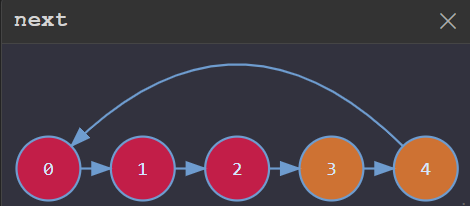
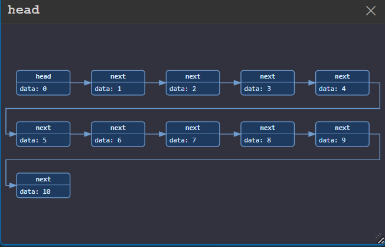

# C++ Debug Visualizer

A VS Code extension that visualizes debug variables in real time during C++ debugging sessions. Designed for competitive programming, algorithm study and teaching.

## Getting Started

Install from the VS Code Extension Marketplace by searching **"C++ Debug Visualizer"**.

## Usage

1. Start a debug session (any debugger — cppdbg, lldb, etc.).
2. A webview panel opens beside your editor with a **sidebar** (variable tree) and a **dashboard** (canvas).
3. **Check** a variable in the sidebar to create a visualization block on the dashboard.
4. **Drag** blocks anywhere on the canvas. **Click** a block (without dragging) to open its settings popup.
5. In the popup header: pick a **visualizer type** (top-left dropdown) or **copy as image** (📋 button).
6. The popup has three tabs: **Basic**, **Modification**, and **Advanced**.

All block positions, sizes, types, and settings persist across debug steps and panel close/reopen.

---

## Visualizers

### Text

Shows the raw value of any scalar variable (int, float, string, etc.). Flashes when the value changes.

- **Basic settings:** None
- **Advanced settings:** None

### Array

Displays arrays, vectors, sets, maps, queues, stacks, and any variable with indexed children as a row of connected boxes.

- **Basic settings:**
  - **Base** / **Limit** — Show elements from index `base` to `limit` (inclusive). If limit is empty, shows from base to the end.
  - **Label** — Toggle between `Index` (numeric indices) and `Name` (child's own name — useful for STL maps).
- **Advanced settings:**
  - **Data Fields** — By default, all leaf child values are shown. Add a specific field path (e.g. `val`, `key/name`) to display only that member. Set a nickname if the field name is too long.

### Bar

Vertical bar chart for numeric arrays. Supports negative values with an auto-positioned zero line.

- **Basic settings:**
  - **Base** / **Limit** — Index range (inclusive).
  - **Pointers** — Add named pointer variables. The pointer's integer value highlights the corresponding bar's index label.
- **Advanced settings:** None

### Matrix

Grid of cells for 2D arrays. Each cell shows its `(row, col)` coordinate and value.

- **Basic settings:**
  - **Row Base** / **Row Limit** — Row index range (inclusive).
  - **Col Base** / **Col Limit** — Column index range (inclusive).
  - **Pointers** — Add named pointer variables (same as Bar).
- **Advanced settings:** None

### Graph

SVG-based graph visualization supporting four input formats.

- **Basic settings:**
  - **Base** / **Limit** — Node index range.
  - **Format** — `adj_matrix`, `adj_list`, `next`, or `edge_list`. Auto-detected on first update:
    - adjcency matrix in 2d array → `adj_matrix`
    - Flat values (no grandchildren, useful for tree,permutation) → `next`
    - each child is a edges → `edge_list`
    - adjcency list in 2d array → `adj_list`
  - **Direction** — Toggle `Directed` / `Undirected` (auto-detected by checking if every edge has a reverse).
  - **Layout** — `circle` (ring), `layer` (BFS layers, useful for tree), `chain` (linear), or `spring` (dynamic).
- **Advanced settings:**
  - **Root** (layer layout only) — BFS root node. Default: auto-detect node with in-degree 0.
  - **Weights** — `none` or `weighted` (shows edge weight labels). Auto-detected for adj_matrix with values beyond 0/1.
  - **Rev.Edges** — Reverse all edge directions. Useful for tree that store parent node(with format:next and layout:layer)
  - **Next** (adj_list/next) — Struct field name for the edge target.
  - **Weight** (adj_list/next) — Struct field name for the edge weight.
  - **Edge List Fields** (edge_list only):
    - **from (u)** — Field for source node.
    - **to (v)** — Field for target node.
    - **weight (w)** — Field for weight.

Nodes are draggable within the SVG. New nodes and edges flash on appearance.

### LinkedList

SVG graph for linked list head pointers. Rectangular nodes showing data fields, connected by pointer edges.

- **Basic settings:**
  - **Data fields** — Field paths to display as node data (e.g. `val`). Auto-detected on first update by separating non-pointer leaf fields from pointer fields.
  - **Pointers** — Pointer field paths that define edges (e.g. `next`, `left`, `right`). Each has a nickname for the edge label. Auto-detected on first update.
  - **Direction** — Toggle `Directed` / `Undirected`.
- **Advanced settings:**
  - **Layout** — `auto`, `snake`, or `layer`.

Works out-of-the-box for standard linked list nodes — auto-detects which struct members are data vs. pointer fields.

### Heap

SVG tree for array-based binary heaps. Nodes are positioned in a binary tree layout based on heap array indexing.

- **Basic settings:**
  - **Base** — Toggle `0-based` / `1-based` indexing.
  - **Limit** — End index (inclusive).
- **Advanced settings:**
  - **Data Fields** — Field paths to show per node (fieldName + nickname), same pattern as Array.

---

## Modifiers

Modifiers are visual overlays that decorate a visualizer's rendered elements using a bound variable. Add them in the **Modification** tab of a block's popup. They work on all visualizer types (HTML boxes and SVG nodes).

### Color

Binds an array variable. `color[i]` sets the background/fill color of element `i`.

- If the value is a hex string (e.g. `#FF0000`), it is used directly.
- If choosing rainbow, it shows different color for each value, and the color is not correspond to how big the value is.
- If numeric, it is mapped to a palette color.
- **Settings:**
  - **Palette** — `heat`, `cool`, or `rainbow`.
  - **Opacity** — Slider from 0.1 to 1.0 (default 0.80).

### Label

Binds an array variable. `label[i]` appends a text label to element `i`. A scalar value labels all elements.

- **Settings:**
  - **Color** — Label text color (default gold `#ffd700`).

### Pointer

Binds a scalar variable. Its integer value highlights the single element at that index.

- **Settings:**
  - **Color** — Highlight color (default red `#ff4444`).

### Range

Binds two scalar variables (L and R) to highlight all elements within an index range.

- **Settings:**
  - **L** — Variable name for the low bound.
  - **R** — Variable name for the high bound.
  - **Range** — Bracket type: `[l,r]`, `(l,r)`, `[l,r)`, or `(l,r]`. decided which
  - **Color** — Highlight color (default light blue `#4fc3f7`).

## example:

